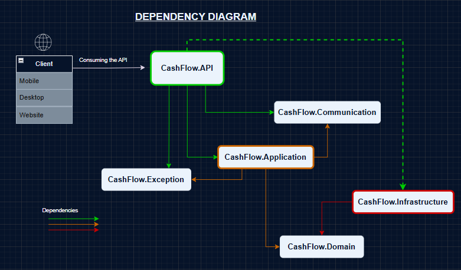

# 📘 Projeto - CashFlow


**Autor**: [Guilherme Barbosa](https://github.com/devguilherme-b)

---

## 📑 Sumário

1. [Objetivo](#-objetivo)  
2. [Descrição](#-descrição)  
3. [Especificação do Software](#-especificação-do-software)  
4. [Tecnologias Utilizadas](#-tecnologias-utilizadas)  
5. [Descrição das Tecnologias](#-descrição-das-tecnologias)  
6. [Arquitetura](#arquitetura)  
7. [Diagrama do Projeto](#diagrama-do-projeto)  
8. [Créditos e Recomendações](#-créditos-e-recomendações)  
9. [Meios de Contato](#-meios-de-contato)

---

## 🎯 Objetivo

Ajudar as pessoas a **organizar suas despesas** de forma rápida, prática e segura.

---

## 📄 Descrição

O CashFlow é um sistema voltado para o controle financeiro pessoal, desenvolvido com foco em arquitetura limpa e princípios **SOLID**. O sistema é baseado na stack **.NET com C#**, estruturado para aplicações Web e APIs, com persistência em banco de dados relacional e práticas modernas de testes e validações.

Com isso, o sistema possibilita:

- **CRUD** (Create, Read, Update, Delete) completo;
- **Geração e exportação de relatórios para Excel**, com download habilitado.

Continue lendo para mais informações!

---

## 🛠️ Especificação do Software

- Projeto dividido em duas grandes camadas: `src` (código principal) e `tests` (testes automatizados);
- Integração com banco de dados relacional (MySQL);
- Utilização do Entity Framework Core como ORM (Object-Relational Mapping);
- Implementação de testes unitários para validação de regras de negócio;
- **Exceptions customizadas**, com mensagens traduzidas para quatro idiomas: **Inglês, Francês, Português do Brasil e Português de Portugal**;
- **Middleware e filtros de requisição** configurados para definir dinamicamente o idioma das respostas de erro;
- Geração e exportação de relatórios financeiros em formato Excel;
- Validações sólidas e reutilizáveis utilizando FluentValidation;
- Geração de dados falsos para testes automatizados com a biblioteca Bogus.

---

## 🧰 Tecnologias Utilizadas

- C#  
- .NET 8  
- ASP.NET Core Web App (MVC)  
- ASP.NET Core Web API  
- Entity Framework Core  
- MySQL  
- xUnit  
- FluentValidation  
- AutoMapper  
- Bogus  
- Shouldly  
- Visual Studio  
- Class Library  
- ClosedXML  

---

## 🔍 Descrição das Tecnologias
- [**FluentValidation**](https://github.com/FluentValidation/FluentValidation): Biblioteca para validação de dados.
- [**Bogus**](https://github.com/bchavez/Bogus): Geração de dados falsos para testes.  
- [**Shouldly**](https://github.com/shouldly/shouldly): Biblioteca para tornar as asserções dos testes mais legíveis.  
- [**ClosedXML**](https://github.com/ClosedXML/ClosedXML): Pacote NuGet usado para ler, manipular e escrever arquivos em Excel (.xlsx).
- **C#**: Linguagem principal usada no desenvolvimento da aplicação.  
- **.NET 8**: Plataforma de desenvolvimento moderna, multiplataforma e de alto desempenho.  
- **ASP.NET Core Web API**: Responsável por fornecer os endpoints RESTful.  
- **Entity Framework Core**: ORM para mapeamento objeto-relacional.  
- **MySQL**: Banco de dados relacional utilizado para persistência.  
- **xUnit**: Framework de testes unitários.  
- **Visual Studio**: IDE utilizada no desenvolvimento. 
- **ASP.NET Core Web App (MVC)**: Para desenvolvimento da interface web com padrão Model-View-Controller.  
 
---

## 🧱 Arquitetura

O CashFlow segue o princípio **S (Single Responsibility)** do SOLID, com uma arquitetura baseada em responsabilidades bem definidas e separadas em camadas.

### 📁 Estrutura

```
- src
   |__ CashFlow.API
   |__ CashFlow.Application
   |__ CashFlow.Communication
   |__ CashFlow.Domain
   |__ CashFlow.Exception
   |__ CashFlow.Infrastructure
- tests
   |__ CommomTestsUtilities
   |__ Validator.Tests
```

### 📂 Descrição das camadas em `src`:

- **CashFlow.API** – Responsável por receber requisições e devolver respostas.  
- **CashFlow.Application** – Contém a lógica de negócio da aplicação.  
- **CashFlow.Communication** – Define as classes de entrada (requests) e saída (responses).  
- **CashFlow.Domain** – Reúne as entidades e interfaces compartilhadas.  
- **CashFlow.Exception** – Tratamento de erros personalizados.  
- **CashFlow.Infrastructure** – Implementação de repositórios e persistência de dados.

### 🧪 Descrição das camadas em `tests`:

- **CommonTestsUtilities** – Gera dados mockados com Bogus para testes.  
- **Validator.Tests** – Testa validações com cenários diversos.

---

## 🧭 Diagrama do Projeto



O projeto possui dependências bem definidas e aplicadas de forma estratégica, o que garante:

- **Consistência dos dados**
- **Modularidade**
- **Desempenho e manutenção facilitada**

### ℹ️ Entendendo o diagrama:
- **Cada seta** representa uma **dependência** entre projetos.
- Um projeto **independente** é aquele que **não possui dependências externas**, ou seja, **apenas recebe setas** e **não aponta para outros**.


---

## 🙌 Créditos e Recomendações

Este software é fruto de um projeto prático presente na **Formação C#** da [Rocketseat](https://www.rocketseat.com.br/). Durante o curso, foram abordados diversos tópicos essenciais para desenvolvedores .NET Backend, e cada conhecimento foi aplicado neste projeto.

Agradecimentos especiais para:

- **Rocketseat** – Referência em educação para desenvolvedores.  
- **Wellison Arley** – Professor e guia técnico durante o desenvolvimento do projeto.

---

## 📬 Meios de Contato

- **Email**: [devguilhermebarbos@gmail.com](mailto:devguilhermebarbos@gmail.com)  
- **LinkedIn**: [linkedin.com/in/devguilhermebarbosa](https://linkedin.com/in/devguilhermebarbosa)  
- **GitHub**: [github.com/devguilherme-b](https://github.com/devguilherme-b)

---


🧠 Sinta-se à vontade para `sugerir melhorias` ou `contribuir com o projeto! `
